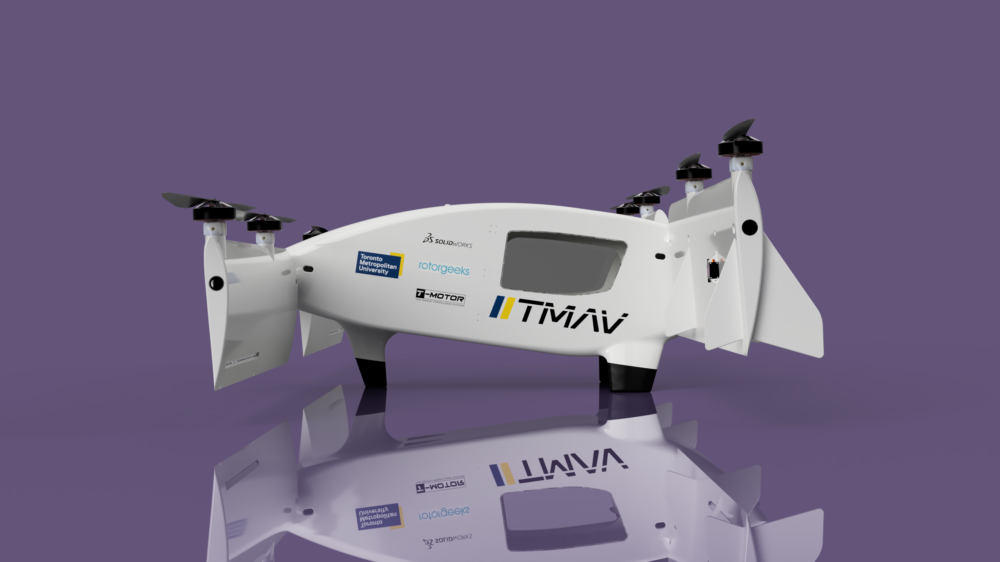

# Air Taxi CAD Model

I created this CAD model of an Urban Air Mobility system for the AEAC student competition in 2023. There were two versions, a tilt wing model, and a standard multirotor model, the multirotor model was used during the competition.

## Multirotor Model

The render can be seen below:

The physical build can be seen below:

## Tilt Wing Model

The renders can be seen below:

The physical build can be seen below:

